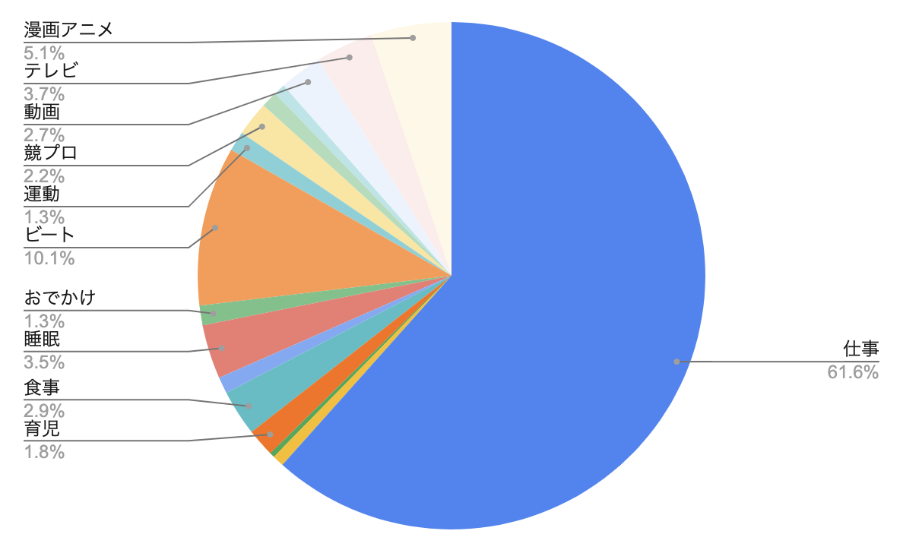

## この企画の説明

- スマホを見ている時間が長いなと思ったので1時間に抑えようと試みました。

## 結果

😭**失敗**😭

youtubeは結構気軽に禁止できたのですが、スマホ1時間は結構きつかった・・・  
外出先で待ち時間ができた時などついつい触ってしまい1時間をこしちゃいました。

それでも、もともと2-3時間見ていたのが1時間半程度には抑えられました。  
なんだかんだこのチャレンジ後も習慣続く傾向にあるみたいなので、スマホも意識的に遠ざけようと思います。

## 今月の時間の使い方

なんだかんだ時間の使い方の記録を続けています。  
分類が増えすぎて見にくいので、近々リファクタ予定。

### 平日

### 休日

こどものお風呂後に趣味の時間をずらして生活リズムがまた悪くなりはじめました・・・  
夏休み中に改善予定・・・

- 就寝の平均時間
  - 平日 2:30
  - 休日 2:48
- 起床の平均時間
  - 平日 10:15
  - 休日 11:04
- 睡眠の平均時間
  - 平日 7:22
  - 休日 8:32

## その他振り返り

転職したときに「こういうことやりたい」と言っていたドンピシャの仕事ができてめちゃくちゃ楽しいです。  
仕事で興味ある技術など使えて、立ち上げ経験できる機会もそんなにないので楽しんでいきたい

## 来月

こどものおむつをできるだけ交換するチャレンジをします。  
仕事ある日もあるので達成条件は最低でも1日1回で。
