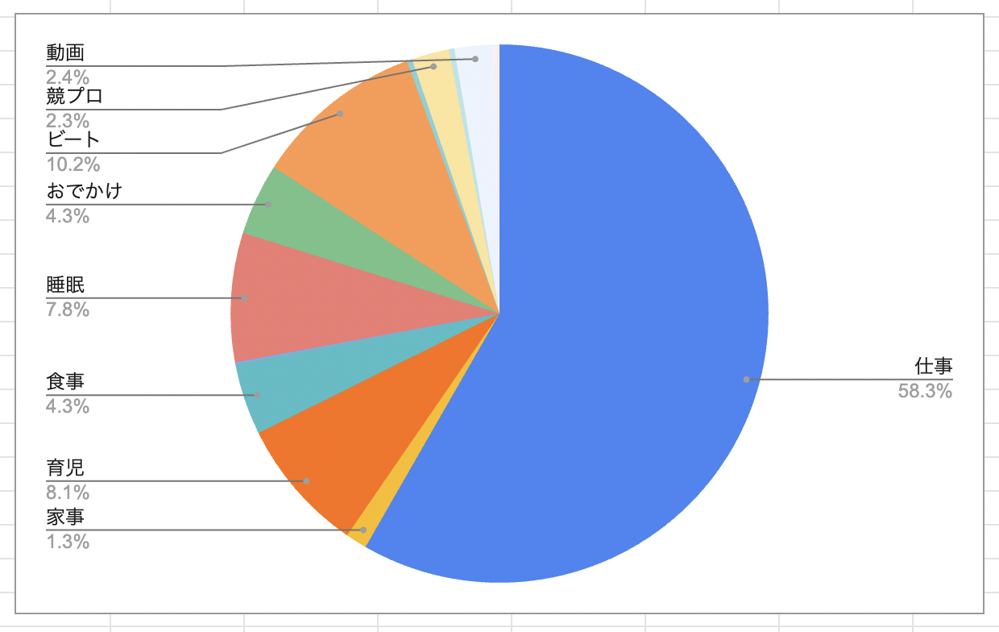
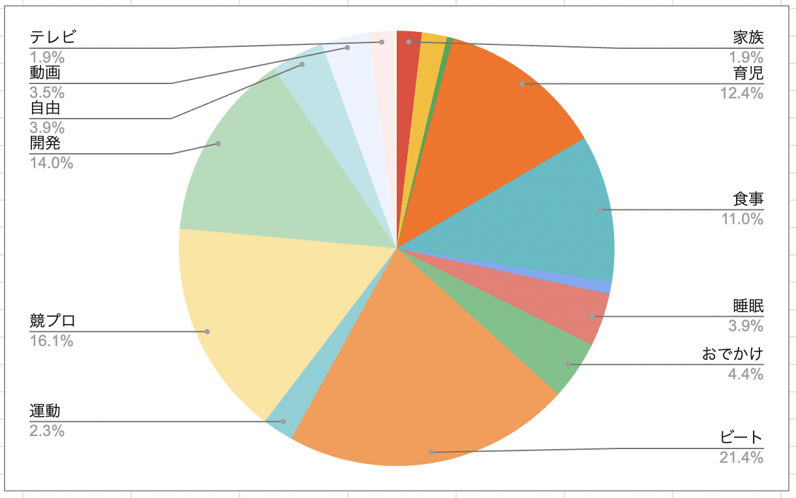

## この企画の説明

- 育休中は普通にやっていたおむつ替えを、仕事はじめてからも意識的にやるように掲げました。

## 結果

🎉**達成**🎉

いざ手をつけちゃえば1分-2分で終わるのですが、なかなか仕事終わって疲れてるとそのやる気が出ない・・・
まあおむつ替えたらそのぶんのんびりしたりお菓子食べたりしてます笑

## 今月の時間の使い方

なかなか寝る時間が遅くなっちゃっています。。
仕事終わって、こどもをお風呂にいれて、、その後に勉強して、趣味の時間・・・って思うとなかなか寝られません。。

### 平日

### 休日

先月よりは改善しましたが、なんか時間の割に寝てる気がしません・・・
うーん、、、

- 就寝の平均時間
  - 平日 2:08
  - 休日 2:24
- 起床の平均時間
  - 平日 10:24
  - 休日 11:04
- 睡眠の平均時間
  - 平日 8:00
  - 休日 8:47

## その他振り返り

子供のお世話をしつつ、仕事も結構新しいことづくしなのでちょっと疲れてきたかも・・・？  
休日も趣味をして、勉強して、育児して、と寝る以外あんまり休息できていない気がする、、なんか対策あるのかなぁ。。

## 来月

蟻本の4-2までを読み切る
