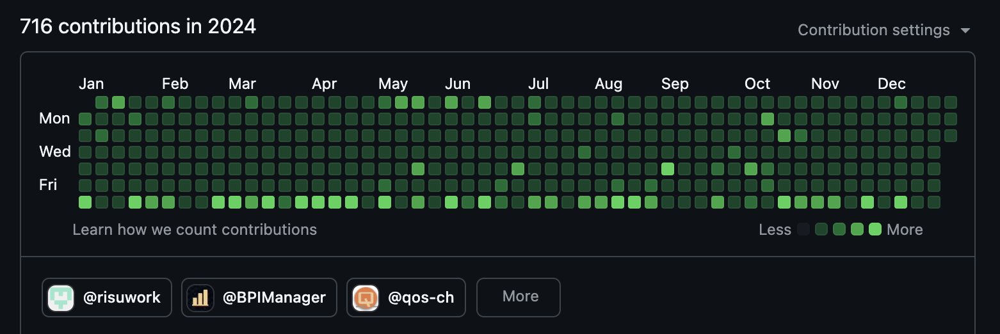

1年の振り返りをしようと思います。  
今年はなんだか色々と悩む1年だった気がします。

結構子供と過ごす時間が増え、たくさん公園に出向いた気がします。  
同じ時間に行かないのでパパ友・・・とまではいきませんが、来年は子供の交友関係を広げられるように頑張ります！

仕事はさらに広い範囲を考える仕事になり、個人的にバリューを発揮するのに悩んだ1年でした。  
抽象的な仕事だとスイッチをいれられなかったり、スイッチをいれたとしてもどうすればいいかわからなかったりと悩むことが多かったです。

ちなみに毎日コードをコミットする習慣、は継続して実施できました。エンジニアでいるうちは続けたいですね〜。

## 仕事

### 1-3月

チームのリーダーをしつつ案件も色々考慮していててんやわんやしていました。  
ただ、忙しかったができる範囲の仕事をやっていた印象です。

### 4-6月

一部自分の仕事を任せられるようになり、よりチーム全体のプロセスを意識できるようになりました。  
開発サイクルをどうするかという部分にメスをいれることができたのは後から振り返ると成長かなと思います。

### 7-10月

このころは、最低限の仕事しかできていなかったなと自分で思っていながらもがいていた期間でした。  
やらなければならない仕事はできているのですが、チームの中長期を見据えた仕事に手がつかず、どう手をつけていいのかわからずで罪悪感がありました。。

今思うと「なんか申し訳ないなぁ」と思いながらもがいていた期間も成長なのかなと思いますが、きちんと還元したい気持ちがあります。

### 11-12月

一定自分の中でいろいろ整理がついて抽象的な仕事の手の付け方のヒントが得られたように思えます。  
結局は「分割」と「集中」だな、という結論になりました。書いてしまえば大変あたりまえなのですが・・・

まずは集中する環境をつくる。スマホを遠くにおいて、slackを閉じる！  
その後タスクを分割する。わからなければ現段階のフィーリングでとりあえず分けちゃう、やりながらアジャストすればよくて仮置きするのが大事。  
そして時間を決めて仕事に取り組む。時間がきたらslackを開いて、違う毛色の仕事を行う。

これでだいぶ自分は仕事が進むようになりました。  
slackは便利な一方、自分との対話が必要だったりして集中を要する仕事はやりにくくなったのかなぁという印象です。

## プライベート

音ゲーはまだ続けていて、楽しく続けられています。年上で上達している方がいらっしゃるので自分もまだまだ頑張れそうです。  
握力はのんびり続けています。最高は60.5kgくらいだったかな、、長期的な趣味なのでのんびり続けていこうと思います。  
競プロは水色と青色を行き来し、最後に黄perf✖️2をとって青perfに落ち着いたと信じています。いつかは黄色も目指したい・・・！

## 感想など

今年も、圧倒的かといわれると微妙ですが成長はできたのかなという1年になりました。  
特に仕事面は大きく壁を突破できたような気がしています。

ただ、仕事以外のインプットやアウトプットは正直だいぶできていないのでちょっと危機感を感じております・・・  
とはいえ時間の確保もなかなか難しいなぁと思いつつ、、これも分割と集中なんだろうなという気がします。
